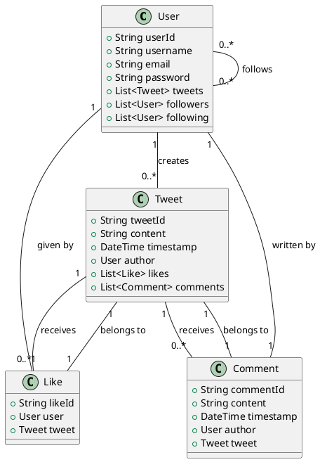
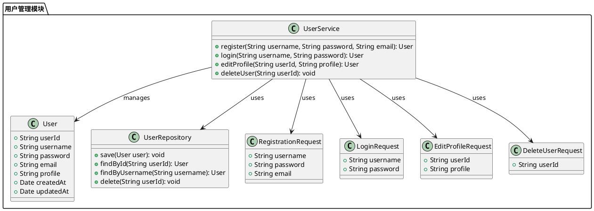
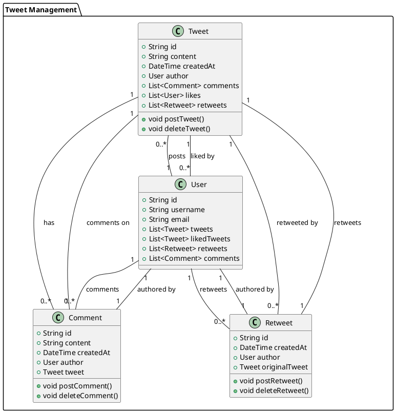
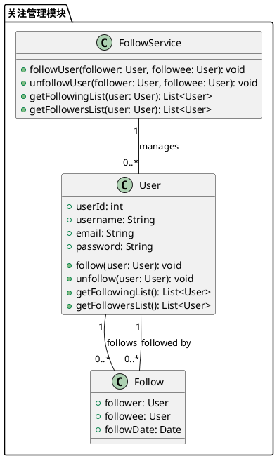
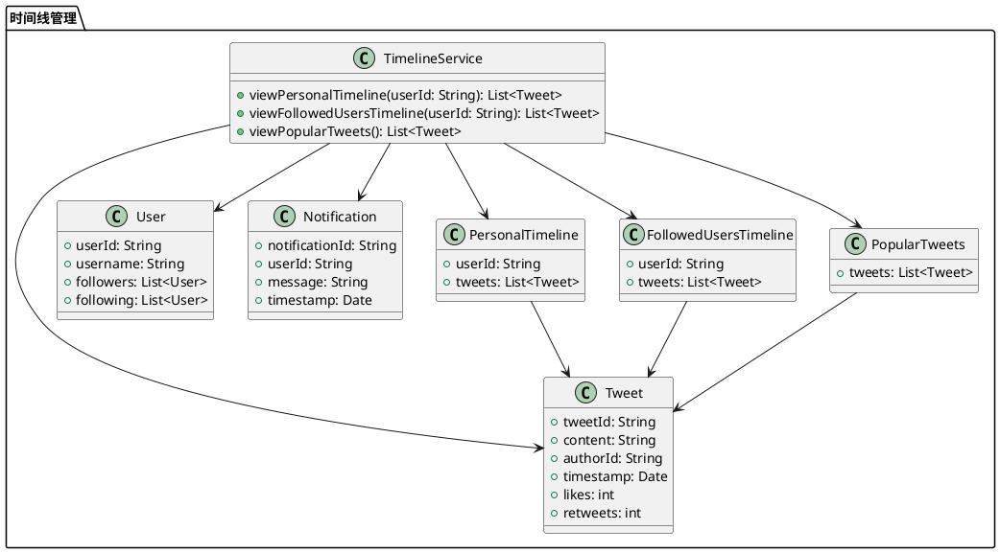
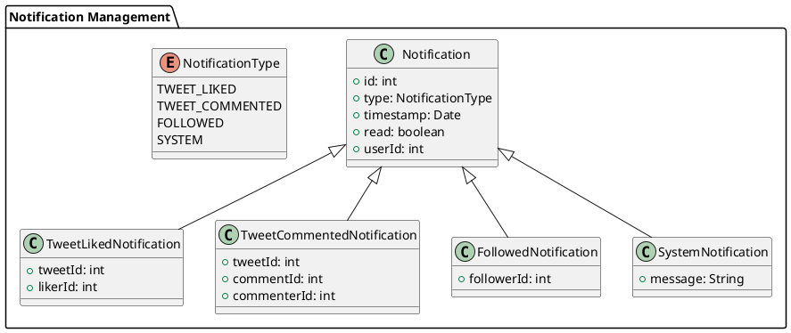
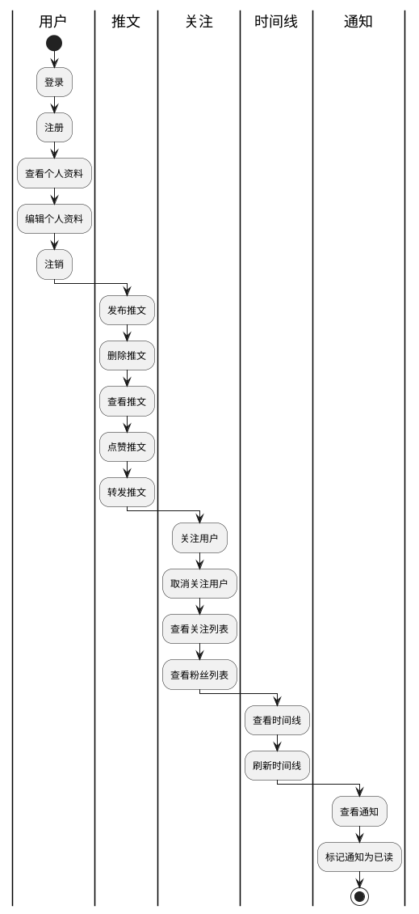
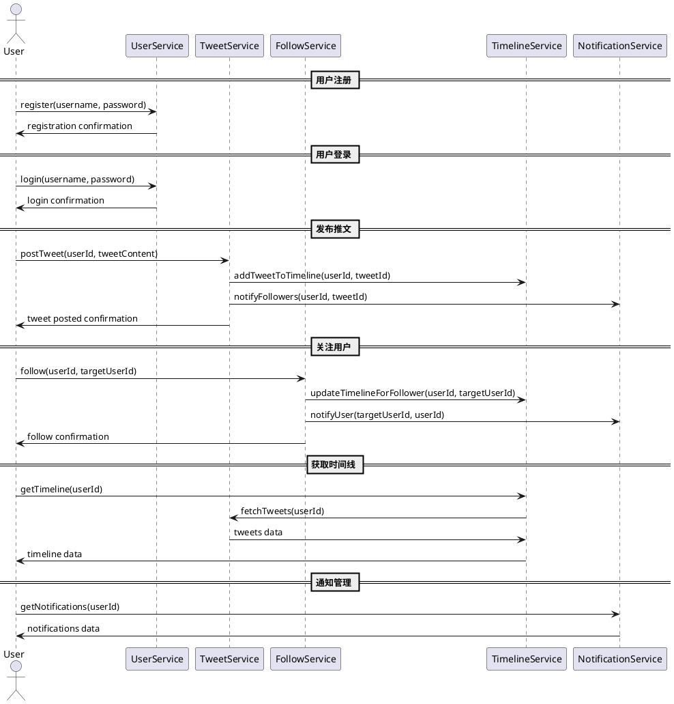
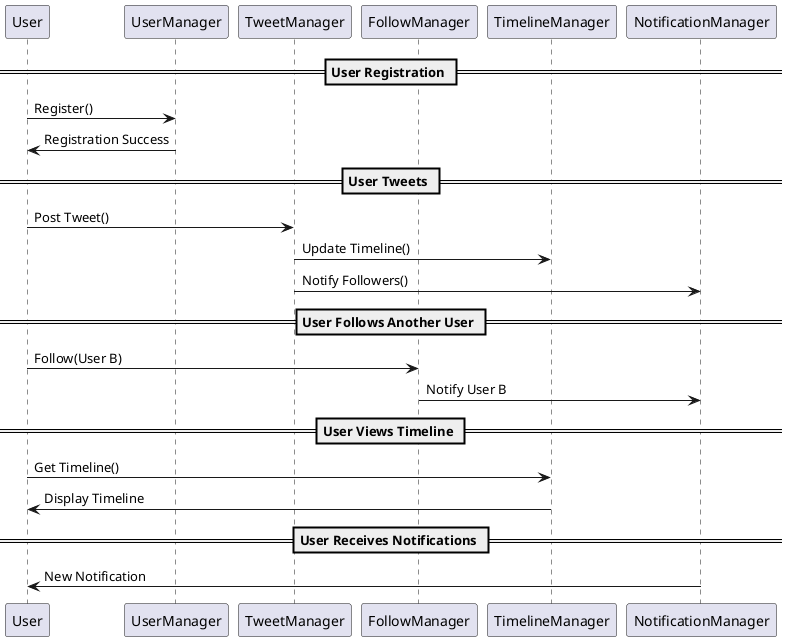

# Twitter 风格系统设计

## 总体领域模型设计

Designing a Twitter-like system involves several key components such as users, tweets, followers, and likes. Below is a simplified PlantUML script to represent the business domain model for such a system.

### Explanation:

1. **User**: Represents a user in the system. Each user has a unique ID, username, email, and password. Users can create tweets, follow other users, and be followed by other users.

2. **Tweet**: Represents a tweet in the system. Each tweet has a unique ID, content, timestamp, and an author (User). Tweets can receive likes and comments.

3. **Like**: Represents a like on a tweet. Each like has a unique ID, a user who liked the tweet, and the tweet that was liked.

4. **Comment**: Represents a comment on a tweet. Each comment has a unique ID, content, timestamp, an author (User), and the tweet it belongs to.

### Relationships:

- A **User** can create multiple **Tweets**.
- A **User** can follow multiple other **Users** and be followed by multiple other **Users**.
- A **Tweet** can receive multiple **Likes** and **Comments**.
- A **Like** is given by a **User** and belongs to a **Tweet**.
- A **Comment** is written by a **User** and belongs to a **Tweet**.

This model captures the core entities and relationships needed to build a Twitter-like system.

## 详细设计

设计一个 Twitter 风格的系统，可以分为以下两级功能架构：

### 第一级功能架构
1. 用户管理
   - 用户注册
   - 用户登录
   - 用户资料编辑
   - 用户注销
2. 推文管理
   - 发布推文
   - 删除推文
   - 点赞推文
   - 转发推文
   - 评论推文
3. 关注管理
   - 关注用户
   - 取消关注
   - 查看关注列表
   - 查看粉丝列表
4. 时间线管理
   - 查看个人时间线
   - 查看关注用户时间线
   - 查看热门推文
5. 通知管理
   - 推文被点赞通知
   - 推文被评论通知
   - 被关注通知
   - 系统通知

    

#### 1. 用户管理
用户管理模块负责处理与用户账户相关的所有操作，包括注册、登录、资料编辑和注销。

- **用户注册**：新用户可以通过填写用户名、密码、邮箱等信息来创建一个新账户。系统需要验证邮箱的唯一性和密码的强度。
  
- **用户登录**：已有账户的用户可以通过用户名和密码登录系统。系统需要支持多种登录方式，如邮箱登录、手机号码登录、第三方登录（如Google、Facebook等）。

- **用户资料编辑**：登录用户可以编辑个人资料，包括头像、昵称、简介、位置等信息。系统需要确保资料的合法性和安全性。

- **用户注销**：用户可以选择注销账户，系统需要提供确认步骤以防止误操作，并确保用户数据的安全删除。

#### 2. 推文管理
推文管理模块负责处理用户发布的推文，包括发布、删除、点赞、转发和评论。

- **发布推文**：用户可以发布包含文本、图片、视频等内容的推文。系统需要支持多媒体文件的上传和存储。

- **删除推文**：用户可以删除自己发布的推文，系统需要确保删除操作的不可逆性。

- **点赞推文**：用户可以对其他用户的推文进行点赞，系统需要记录点赞数并更新推文的状态。

- **转发推文**：用户可以转发其他用户的推文，系统需要记录转发关系并更新推文的传播路径。

- **评论推文**：用户可以对推文进行评论，系统需要支持评论的嵌套显示和管理。

#### 3. 关注管理
关注管理模块负责处理用户之间的关注关系，包括关注、取消关注、查看关注列表和粉丝列表。

- **关注用户**：用户可以关注其他用户，系统需要更新关注关系并通知被关注者。

- **取消关注**：用户可以取消对其他用户的关注，系统需要更新关注关系。

- **查看关注列表**：用户可以查看自己关注的用户列表，系统需要支持分页显示和搜索功能。

- **查看粉丝列表**：用户可以查看关注自己的用户列表，系统需要支持分页显示和搜索功能。

#### 4. 时间线管理
时间线管理模块负责展示用户的推文和关注用户的推文，包括个人时间线、关注用户时间线和热门推文。

- **查看个人时间线**：用户可以查看自己发布的所有推文，系统需要按时间顺序排列并支持分页显示。

- **查看关注用户时间线**：用户可以查看自己关注的用户发布的推文，系统需要按时间顺序排列并支持分页显示。

- **查看热门推文**：用户可以查看系统推荐的热门推文，系统需要根据点赞数、转发数等指标进行排序。

#### 5. 通知管理
通知管理模块负责处理用户的各种通知，包括推文被点赞、被评论、被关注和系统通知。

- **推文被点赞通知**：当用户的推文被其他用户点赞时，系统需要发送通知。

- **推文被评论通知**：当用户的推文被其他用户评论时，系统需要发送通知。

- **被关注通知**：当用户被其他用户关注时，系统需要发送通知。

- **系统通知**：系统可以发送各种公告和提醒，如功能更新、活动通知等。

## 领域设计

### 用户管理模块

这个模型包括用户注册、用户登录、用户资料编辑和用户注销等功能。

这个PlantUML脚本定义了用户管理模块的主要类和它们之间的关系：

- `User` 类表示用户实体，包含用户的基本信息。
- `UserService` 类提供用户管理的主要功能，如注册、登录、编辑资料和注销。
- `UserRepository` 类负责用户数据的持久化操作。
- `RegistrationRequest`、`LoginRequest`、`EditProfileRequest` 和 `DeleteUserRequest` 类分别表示注册、登录、编辑资料和注销的请求数据。

希望这个模型能够帮助你理解用户管理模块的设计。

### 推文管理模块

这个模型包括发布推文、删除推文、点赞推文、转发推文和评论推文的相关类和关系。

这个PlantUML脚本定义了以下类及其关系：

- `Tweet`类表示推文，包含推文的内容、创建时间、作者、评论、点赞和转发。
- `User`类表示用户，包含用户的基本信息以及用户发布的推文、点赞的推文、转发的推文和评论。
- `Comment`类表示评论，包含评论的内容、创建时间、作者和所属推文。
- `Retweet`类表示转发，包含转发的创建时间、作者和原始推文。

这些类之间的关系通过关联线表示，例如，一个`Tweet`可以有多个`Comment`，一个`User`可以发布多个`Tweet`等。

### 关注管理模块

解释：
1. **User** 类表示用户，包含用户的基本信息和关注、取消关注、获取关注列表和粉丝列表的方法。
2. **Follow** 类表示关注关系，包含关注者、被关注者和关注日期。
3. **FollowService** 类提供关注管理的服务，包括关注用户、取消关注、获取关注列表和粉丝列表的方法。

这个模型展示了用户之间的关注关系以及相关的服务方法。希望这对你有帮助！

### 时间线管理模块

这个模型包括查看个人时间线、查看关注用户时间线和查看热门推文的功能。

这个PlantUML脚本定义了时间线管理模块的领域模型，包括以下几个主要类：

1. `TimelineService`：时间线服务类，包含查看个人时间线、查看关注用户时间线和查看热门推文的方法。
2. `Tweet`：推文类，包含推文的基本信息。
3. `User`：用户类，包含用户的基本信息以及关注和被关注的用户列表。
4. `Notification`：通知类，包含通知的基本信息。
5. `PersonalTimeline`：个人时间线类，包含用户ID和该用户的推文列表。
6. `FollowedUsersTimeline`：关注用户时间线类，包含用户ID和该用户关注的用户的推文列表。
7. `PopularTweets`：热门推文类，包含热门推文列表。

这些类之间的关系通过箭头表示，`TimelineService`类依赖于其他类来实现时间线管理的功能。

### 通知管理模块

在这个模型中：

- `Notification` 是一个基类，包含所有通知的通用属性，如 `id`、`type`、`timestamp`、`read` 和 `userId`。
- `NotificationType` 是一个枚举，定义了不同类型的通知：推文被点赞、推文被评论、被关注和系统通知。
- `TweetLikedNotification`、`TweetCommentedNotification`、`FollowedNotification` 和 `SystemNotification` 是具体的通知类型，继承自 `Notification` 类，并包含各自特有的属性。

这个模型可以帮助你在设计和实现通知管理模块时，清晰地理解不同类型通知的结构和关系。

## UML 图

### 用例图

这个脚本涵盖了用户管理、推文管理、关注管理、时间线管理和通知管理五个主要功能。

```plantuml
@startuml
actor User

package "User Management" {
    usecase "Register" as UC_Register
    usecase "Login" as UC_Login
    usecase "Logout" as UC_Logout
    usecase "Update Profile" as UC_UpdateProfile
}

package "Tweet Management" {
    usecase "Post Tweet" as UC_PostTweet
    usecase "Delete Tweet" as UC_DeleteTweet
    usecase "Like Tweet" as UC_LikeTweet
    usecase "Retweet" as UC_Retweet
}

package "Follow Management" {
    usecase "Follow User" as UC_FollowUser
    usecase "Unfollow User" as UC_UnfollowUser
}

package "Timeline Management" {
    usecase "View Timeline" as UC_ViewTimeline
    usecase "Refresh Timeline" as UC_RefreshTimeline
}

package "Notification Management" {
    usecase "View Notifications" as UC_ViewNotifications
    usecase "Mark Notification as Read" as UC_MarkNotificationRead
}

User --> UC_Register
User --> UC_Login
User --> UC_Logout
User --> UC_UpdateProfile

User --> UC_PostTweet
User --> UC_DeleteTweet
User --> UC_LikeTweet
User --> UC_Retweet

User --> UC_FollowUser
User --> UC_UnfollowUser

User --> UC_ViewTimeline
User --> UC_RefreshTimeline

User --> UC_ViewNotifications
User --> UC_MarkNotificationRead

@enduml
```

这个Use Case Diagram描述了一个用户可以执行的各种操作，包括注册、登录、发布推文、关注其他用户、查看时间线和通知等。希望这对你有帮助！

### 活动图

这个图表展示了用户管理、推文管理、关注管理、时间线管理和通知管理的基本活动流程。

这个Activity Diagram展示了用户在系统中的主要活动。每个垂直泳道代表一个功能模块，用户可以在这些模块中执行不同的操作。你可以根据需要进一步细化每个模块的活动。

### 顺序图

这个 Sequence Diagram 涵盖了以下几个主要功能：
1. 用户注册和登录
2. 发布推文
3. 关注用户
4. 获取时间线
5. 通知管理

每个功能模块（用户管理、推文管理、关注管理、时间线管理、通知管理）都被表示为一个独立的服务（UserService, TweetService, FollowService, TimelineService, NotificationService），并且展示了用户与这些服务之间的交互过程。

### 时序图

以下是一个简单的 PlantUML 脚本示例，展示了用户管理、推文管理、关注管理、时间线管理和通知管理的交互。

这个脚本展示了一个用户注册、发推文、关注其他用户、查看时间线和接收通知的基本流程。你可以根据具体需求进一步扩展和细化这个脚本。